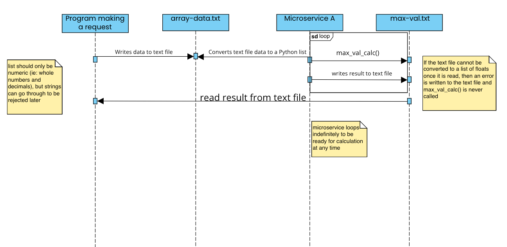

Allows a user to request the program to find the maximum value of a list of numbers they provide via input.

How to use the program:
1. Execute maxVal.py
2. Execute uiMaxVal.py
3. Follow the prompts in uiMaxVal.py
    1. Submitting yes will allow for you to input a list of numbers.
    2. Submitting the list will trigger maxVal.py to receive your list as a text file.
4. The file is received and read by maxVal.py
    1. The text file will then be converted to a valid format for calculation.
    2. If the calculation is successful then the maximum value will be written to max-val.txt.
    3. If something goes wrong, an error message is written into max-val.txt.
5. uiMaxVal.py will then return the results of max-val.txt for you before beginning the prompt cycle again.
6. Submit no to exit.

